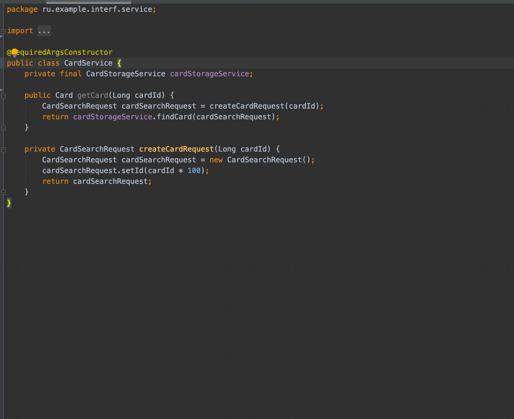

## Как писать SOLIDно


<br>&nbsp;&nbsp;&nbsp;&nbsp;В предыдущей статье [](LINK) я описал примерный путь и развитие событий для среднестатистического проекта
по качеству кода. На пути к качеству разработчики встречают много компрописсов, один из которых - *где релиз*. Всех можно понять, но
совершенствую свой код с получением опыта, однажды можно добраться до *релиза* так, что приятно будет вернуться в свой репозиторий.
<br>&nbsp;&nbsp;&nbsp;&nbsp;Большинство примеров в интернете пишется с примерами на псевдо-коде, далекому от промышленного,
зачастую это не дает программисту необходимого знания, о том, как же все таки применить все эти принципы.
Здесь хочу привести пример, чтобы ответить на вопрос зачем и как писать чище.

В классическом Java-проекте есть классы-сервисы, которые написаны примерно таким образом, но имеют в среднем больше строк.
```java
@RequiredArgsConstructor
public class AccountService {

    private final CardService cardService; //class
    private final AccountRepository accountRepository;
    private final AccountProperties accountProperties;

    public Account getAccount(AccountRequest accountRequest, Long cardId) {
        AccountEntity accountEntity = accountRepository.find(accountRequest.getId());
        Card card = cardService.getCard(cardId);
        accountEntity.setCard(card);
        return doAccountMagic(account);
    }
    
    private Account doAccountMagic(AccountEntity accountEntity) {
        Account account = new Account();
        Amount specificAmount = accountEntity.getAmount();
        specificAmount.setValue(
                specificAmount.getValue() * accountProperties.getMagicBusinessValue()
        );
        account.setAmount(specificAmount);
        return account;
    }

    public Account getAccount(AccountRequest accountRequest) {
        ...
    }
}
``` 

Обращу внимание, что `CardService` и `AccountService` являются классами, без выделенного интерфейса.
Разработчики смержили код, ведь необходимости в интерфейсе явной не было. Мы догадываемся, что это классы какого-то REST API
сервиса, но также это могут быть классы библиотеки, немного в другом виде или классы в монолитном модуле.
<br>В будущем эти классы могут постигнуть различные изменения, но все они потребуют больше изменений, нежели, если бы был выделен интерфейс.
- Для любого изменения, связанного с `CardService`:
  - `AccountService` в библиотеке: придется изменить `AccountService` и пересобрать библиотеку или писать адаптер в текущем репозитории.
    * Если бы был выделен интерфейс CardService - можно было бы изменить реализацию, передав в конструктор.
  - `AccountService` в текущем проекте: придется изменить `AccountService`, соответственно его тесты.
    * Звучит несложно, но в случае реально промышленного случая таких изменений будет гораздо больше.

Кроме проблем связанных с будущими изменениями есть и другие причины выделить интерфейс:
- С интерфейсом API класса выглядит нагляднее. Методы в классы со временем могут быть намешены (private до public), но
при наличии интерфейса API выделено `@Override` аннотациями. Более того, сразу захочется убрать private методы вниз, как неконсистентные:
```java
    @Override
    public Account getAccount(AccountRequest accountRequest, Long cardId) {
        ...
    }
    
    private Account doAccountMagic(Account account) {
        ...
    }
    
    @Override
    public Account getAccount(AccountRequest accountRequest) {
        ...
    }
```
- С созданием интерфейса разработчик описывает основные свойства модуля и здесь необходимо представить ожидания от будущих реализаций в абстрактном виде.
Смотря на интерфейс, внимание сосредоточено на том, **как** могут быть использованы реализации в будущем, потому что нет лишнего
```java
public interface CardService {
    Card getCard(Long cardId);
}
```
- Юнит-тесты проверяют как реализация выполняет логику для интерфейса. При написании тестов нет сомнений, что тестируем
и не приходят в голову такие вещи, как _a как тестировать private методы?_, потому что всегда **тестируется API**, то есть интерфейс. Все private
методы же будут _протестированы_ автоматически, а мы проверяем лишь ожидания от него, имитируя поведение входящих параметров и полей реализации.
- Все паттерны программирования завязаны на интерфейсы и абстрактные классы. Если Вы просто выделите интерфейс, кому-то
(вам) будет удобнее рефакторить это в будущем и, возможно, подводить под определенный паттерн программирования.
```java
/* Оборачиваемый класс */
public class CardService {
    private final CardProperties cardProperties;
    
    public Card getCard(Long cardId) {
        ...
    }
}
/* Класс-обертка */
public class CardServiceWrapper extends CardService {
    /* There is not default constructor available ... */
}
```
Например, вы хотите сделать обертку вокруг `CardService`, который имеет какое-то поле. Класс-обертка в этом примере потребует наличие конструктора,
в котором вызывается конструктор оборачиваемого сервиса. Что нам не нужно, так как данный класс должен принимать *только* объект оборачиваемого типа. В противном случае смысл обертки пропадает
```java
/* Хороший пример */
public class DefaultCardService implements CardService {
    private final CardProperties cardProperties;
    ...
}

/* Класс-обертка */
public class CardServiceWrapper implements CardService {
    private final CardService wrapped;
}
```
Выделив интерфейс, мы дали возможности сделать wrapper по интерфейсу, т.е. оставить класс независимым от реализации.
К другим паттернам или близким им удобным архитектурным решениям это также будет актуально.

<br>&nbsp;&nbsp;&nbsp;&nbsp;С практикой, каждый разработчик приходит к этим моментам, если задавать себе вопросы про потенциальное
переиспользование своего кода и его поддержку. И так мы объяснили **принцип инверсии зависимостей (англ. Dependency inversion principle, DIP)** -
буква «D» в аббревиатуре SOLID:

> Модули верхних уровней не должны зависеть от модулей нижних уровней. Оба типа модулей должны зависеть от абстракций

<br>&nbsp;&nbsp;&nbsp;&nbsp;Для его освоения потребовалось лишь постараться написать так, чтобы было проще работать с этим кодом в будущем, а именно
получить понимание плюсов выделения интерфейсов. Выделив интерфейс (читай _абстракция), мы дали возможность освободить класс (читай _модуль_) от явной
зависимости от реализации и получили выгоду в упрощении изменений и тестировании.
<br>&nbsp;&nbsp;&nbsp;&nbsp;Говоря о практике, IntelliJ Idea выделяет интерфейс за несколько кликов, но конечно рекомендуется начинать разработку
с интерфейсов, чтобы стремиться к чистой сигнатуре методов.

---
<br>&nbsp;&nbsp;&nbsp;&nbsp;Рассмотрим еще спорный момент в примере выше. Мы видим, что класс-сервис `AccountService` меняет значение _amount_, а именно его _value_.
На практике также встречается, что при преобразовании данных от одного слоя к другому данные меняются, но всегда это делается по разному, и программисты часто принимают решения
добавить конвертацию прямо в классе-сервисе или написать логику форматирования каких-либо полей. Объясняя это тем, что это все еще
ответственность класса - вернуть клиенту класса объект `Account`.
<br>&nbsp;&nbsp;&nbsp;&nbsp;Стоит задавать себе вопросы: _может и другие поля будут изменяться в будущем, одно мы уже конвертируем? как я буду это тестировать?_
Принимая решение, стоит оценить стоимость декомпозиции сейчас в сравнении со стоимостью таких изменений в будущем, где, возможно, коллега будет погружаться в ваш код.
Ответственный ответ на эти вопросы, приведет к коду, с которым комфортнее работать в будущем, а также даст возможность тестировать
конвертацию / форматирование отдельно от остальной логики.
```
/* Пример после рефакторинга AccountService */
public class AccountService {

    private final CardService cardService;
    private final AccountRepository accountRepository;
    private final AmountConverter amountConverter;

    public Account getAccount(AccountRequest accountRequest, Long cardId) {
        AccountEntity account = accountRepository.find(accountRequest.getId());
        Card card = cardService.getCard(cardId);
        account.setCard(card);
        return amountConverter.apply(account);
    }
...
```
Если не забывать про плюсы выделения интерфейса, описанные выше, можно понять, что здесь также будет удобно заимплементить интерфейс `java.util.function.Function` из Java 8 SDK, который
позволит быстро адаптироваться в будущем для конвертации множества объектов `AccountEntity`, путем применение этой функции через `java.util.stream.Stream #map`
```
public class AccountConverter implements Function<AccountEntity, Account> {
    
    private final AccountProperties accountProperties;
    
    @Override
    public Account apply(AccountEntity accountEntity) {
        AmountEntity specificAmount = accountEntity.getAmount();
        specificAmount.setValue(
                specificAmount.getValue() * accountProperties.getMagicBusinessValue()
        );
        account.setAmount(specificAmount);
        return account;
    }
}
```
Полученный класс `AccountConverter` легко переиспользовать и протестировать, где тесты помогут дать представление о данных входящего и выходего объектов,
соответственно можно быстро понять, какое поле `AccountEntity` превращается в какое у `Account`.
<br>&nbsp;&nbsp;&nbsp;&nbsp;С данным рефакторингом мы избавили класс `AccountService` от действительно лишней ответственности в конвертации данных.
Таким образом, мы пришли к букве "S" в аббривиатуре SOLID - принцип единственной ответственности (Single Responsibility). Опять же, мы открыли для себя
известный принцип, задавая себе вопросы, как сделать код лучше.
<br>&nbsp;&nbsp;&nbsp;&nbsp;Про данный принцип стоит заметить, что _единственная причина для изменений_ достаточно неопределенное определение. Таким образом
разработчики зачастую считают, что, если класс имеет простой интерфейс, например, возвращает `Account`, принимая один объект, то он имеет единственную ответственность.
На практике в вашем классе может происхоить преобразование данных в том числе или крайне сложный способ получения данных требует множества логики и строк кода.
Классически принято считать, что если интерфейс работает с разными типами сущностей, например, account и email, то это избыточность и его реализации нарушат принципы единственной ответственности.
Для того, чтобы реализации даже чистого интерфейса все же не разростались, стоит оспаривать свой написанный код и проводить декомпозицию составных частей класса.

<br>&nbsp;&nbsp;&nbsp;&nbsp;Методов проверки своего кода на качество существует много, но хочу предложить один неявный,
но помогающий на code review в том числе.
Предположим, реализация интерфейса CardService будет иметь следующий вид:
```java
@RequiredArgsConstructor
public class DefaultCardService implements CardService {
    private final CardStorageService cardStorageService;

    @Override
    public Card getCard(Long cardId) {
        CardSearchRequest cardSearchRequest = createCardRequest(cardId);
        return cardStorageService.findCard(cardSearchRequest);
    }

    private CardSearchRequest createCardRequest(Long cardId) {
        CardSearchRequest cardSearchRequest = new CardSearchRequest();
        cardSearchRequest.setId(cardId * 100);
        return cardSearchRequest;
    }
}
```
В этом примере хочу обратить внимание на то, что внутри метода тестируемого создается объект `CardSearchRequest`, который не возвращается public методом класса.
Классический юнит-тест для этого класса будет написан так:
```
...
Long id = 200L;
Card expected = mock(Card.class);
when(cardStorageService.findCard(any(CardSearchRequest.class))).thenReturn(expected);

Card actual = cardService.getCard(id);

assertEquals(expected, actual);
```
<br>&nbsp;&nbsp;&nbsp;&nbsp;Неточность данного теста в том, что мы ожидаем **любой** объект `CardSearchRequest`, переданным в метод нашей заглушки `CardStorageService`.
Но, например, если будут вызовы в цикле внутри метода `#getCard`, то данный стаб не подойдет - он даст одинаковое поведение для каждой итерации цикла.
Кроме циклов есть и другие случаи, когда заглушка для **любых значений** подводит.

<br>&nbsp;&nbsp;&nbsp;&nbsp;Чтобы имитировать конкретное поведение вида `when(cardStorageService.findCard(eq(cardSearchRequest)))` необходимо
сделать заглушку созданного объекта `CardSearchRequest`.
На практике создать такой stub может быть крайне сложно или даже невозможно (множество полей, значения которых берутся путем вызова множества _других_ методов _других_ классов).
Более того, делать это будет не совсем правильно, так как в этом случае мы пишем заглушку, потому что мы знаем, как **сейчас работает код**.
В случае изменений придется долго править тест, чтобы подгонять поведение кода внутри тестируемого метода.
<br>&nbsp;&nbsp;&nbsp;&nbsp;Правильнее было бы, чтобы объект `CardSearchRequest` возвращался другим объектом (builder, provider),
в это случае мы могли бы легко имитировать это поведение, и код стал бы гибче для изменений. Стоит помнить,
что **создание объекта**, это тоже ответственность, которая должна быть протестирована **отдельно**.
<br>&nbsp;&nbsp;&nbsp;&nbsp;В данной статье я рассмотрел несколько примеров, которые покрывают несколько классических
моментов, которые можно диагностировать на code review, безусловно их множество, но предложу вопросы, которые стоит предъявлять качеству своего кода,
чтобы найти лучшие решения:
- Удобно ли будет написать классический юнит-тест на этот класс?
- Есть ли паралели с другим кодом, который я писал, можно ли выделить общее?
- Будет ли мне понятно, как работают реализации данного интерфейса через длительный промежуток времени?
- Сможет ли человек, не особо погружаясь в бизнес-логику понять, что делают данные классы?
<br>&nbsp;&nbsp;&nbsp;&nbsp;PS. Пример про букву "D" до "S" выбран осознанно, так как я предлагаю думать не про аббревиатуры, а
реальные полезные применения. Принципы созданы лишь для фиксации опыта и возможности делиться им.
