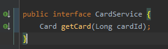
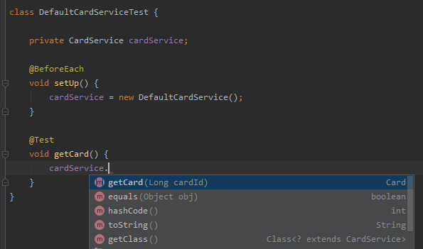

## Как писать SOLIDно


<br>&nbsp;&nbsp;&nbsp;&nbsp;В предыдущей статье [](LINK) я описал примерный путь и развитие событий для средне-статистического проекта
по качеству кода. Здесь хочу попробовать привести пример, чтобы ответить на вопрос зачем и как все же писать чище.

В классическом Java-проекте есть классы-сервисы, которые написаны примерно таким образом, но имеют в среднем больше строк.
```
@RequiredArgsConstructor
public class AccountService {

    private final CardService cardService; //class
    private final AccountRepository accountRepository;
    private final AccountProperties accountProperties;

    public Account getAccount(AccountRequest accountRequest, Long cardId) {
        Account account = accountRepository.find(accountRequest.getId());
        Card card = cardService.getCard(cardId);
        account.setCard(card);
        return doAccountMagic(account);
    }

    /** some logic **/
    private Account doAccountMagic(Account account) {
        Amount specificAmount = account.getAmount();
        specificAmount.setValue(
                specificAmount.getValue() * accountProperties.getMagicBusinessValue()
        );
        account.setAmount(specificAmount);
        return account;
    }

    public Account getAccount(AccountRequest accountRequest) {
        ...
    }
}
``` 

Обращу внимание, что `CardService` и `AccountService` являются классами, без выделенного интерфейса.
Разработчики смержили код, ведь необходимости в интерфейсе явной не было. Мы догадываемся, что это классы какого-то REST API
сервиса, но также это могут быть классы библиотеки, немного в другом виде или классы в монолитном модуле.
В будущем эти классы могут постигнуть различные изменения, но все они потребуют больше изменений, нежели, если бы был выделен интерфейс.
- Для любого изменения, связанного с `CardService`
  - `AccountService` в библиотеке - придется править библиотеку или писать адаптер.
  Если бы был выделен интерфейс CardService - можно было бы изменить реализацию, передав в конструктор.
  - `AccountService` в текущем проекте. В добавок придется изменить и `AccountService`, соответственно его тесты
- С интерфейсом API класса выглядит нагляднее. Методы в классы со временем могут быть намешены (private до public), но
при наличии интерфейса API выделено `@Override` аннотациями. Более того, сразу захочется убрать private методы вниз, как неконсистентные:
```
    @Override
    public Account getAccount(AccountRequest accountRequest, Long cardId) {
        ...
    }

    /** some logic **/
    private Account doAccountMagic(Account account) {
        ...
    }
    
    @Override
    public Account getAccount(AccountRequest accountRequest) {
        ...
    }
```
- С созданием интерфейса разработчик описывает основные свойства и может абстрактно представить ожидания от будущих реализаций.
Смотря на интерфейс, внимание сосредоточено на то, **как** могут быть использованы реализации в будущем 
- В юнит-тестах тестируется как реализация выполняет логику для интерфейса. При написании тестов нет сомнений, что тестируем
и не приходят в голову такие вещи, как _a как тестировать private методы?_, потому что всегда **тестируется API** 
- Подавляющее большинство паттернов программирования завязано на интерфейсы и абстрактные классы. Если Вы просто выделите интерфейс, кому-то
(вам) будет удобнее рефакторить это в будущем и, возможно, подводить под определенный паттерн программирования.
Например, вы хотите сделать обертку вокруг `CardService`, который имеет какое-то поле. Класс-обертка в этом случае потребует реализации конструктора оборачиваемого сервиса,
что нам не нужно.
```
public class CardService {
    private final CardProperties cardProperties;
    
    public Card getCard(Long cardId) {
        ...
    }
}
```


<br>&nbsp;&nbsp;&nbsp;&nbsp;С практикой, каждый разработчик приходит к этим моментам, если задавать себе вопросы про потенциальное переиспользование своего кода и его поддержку.
Сейчас же мы пришли к **принципу Барбары Лисков (The Liskov Substitution Principle)**, буква «L» в аббревиатуре SOLID, и требовалось лишь получить опыт о плюсах интерфейса.
Говоря о практике, IntelliJ Idea выделяет интерфейс за несколько кликов, но конечно рекомендуется начинать с интерфейсов, чтобы стремиться к чистой сигнатуре метода.
---
<br>&nbsp;&nbsp;&nbsp;&nbsp;Рассмотрим еще спорный момент в примере выше. Мы видимо, что классы-сервис меняет значение _amount_, а именно его _value_.
На практике также встречается, что при преобразовании данных от одного слоя к другому данные меняются, но всегда это делается по разному, и люди не грешает
добавить конвертацию в сервисе, это всего-то одно, почему бы и нет.
<br>&nbsp;&nbsp;&nbsp;&nbsp;Стоит задавать себе вопрос: _а могут ли другие поля измениться в будущем, одно ведь мы уже преобразуем?_
Если ответственность разработчика пересилит, то он ответит себе **да** и подумает, как сделать, чтобы было комфортнее в будущем работать с этим кодом, а именно хотелось бы тестировать
это отдельно от остальной логики.
<br>&nbsp;&nbsp;&nbsp;&nbsp;В данном случае стоит выделить отдельную модель для слоя сервиса и отдельную для repository.
Пакеты классов будут выглядить примерно таким образом:
```
package ru.example.repository.domain;

public class AccountEntity {
...
}
```

```
package ru.example.service.domain;

public class Account {
...
}
```
```
public class AccountService {

    private final CardService cardService;
    private final AccountRepository accountRepository;
    private final AmountConverter amountConverter;

    public Account getAccount(AccountRequest accountRequest, Long cardId) {
        AccountEntity account = accountRepository.find(accountRequest.getId());
        Card card = cardService.getCard(cardId);
        account.setCard(card);
        return amountConverter.apply(account);
    }
...
```
Не забывая, про выделение интерфейса, можно взять интерфейс `java.util.function.Function` из Java 8 SDK, который
позволит быстро адаптироваться в будущем для конвертации множества объектов `AccountEntity`, путем применение этой функци через `java.util.stream.Stream #map`
```
public class AccountConverter implements Function<AccountEntity, Account> {
    
    private final AccountProperties accountProperties;
    
    @Override
    public Account apply(AccountEntity accountEntity) {
        AmountEntity specificAmount = accountEntity.getAmount();
        specificAmount.setValue(
                specificAmount.getValue() * accountProperties.getMagicBusinessValue()
        );
        account.setAmount(specificAmount);
        return account;
    }
}
```
Класс `AccountConverter` легко переиспользовать и протестировать, где тесты помогут дать представление о данных входящего и выходего объектов,
соответственно можно быстро понять, какое поле `AccountEntity` превращается в какое у `Account`.
<br>&nbsp;&nbsp;&nbsp;&nbsp;С данным рефакторингом мы избавили класс `AccountService` от действительно лишней ответственности в конвертации данных.
Таким образом, мы пришли к букве "S" в аббривиатуре SOLID - принцип единственной ответственности (Single Responsibility). Опять же, мы открыли для себя
известный принцип, задавая себе вопросы, как сделать код лучше.
<br>&nbsp;&nbsp;&nbsp;&nbsp;Про данный принцип стоит заметить, что _единственная причина для изменений_ достаточно неопределенное определение. Таким образом
разработчики зачастую считают, что, если класс имеет простой интерфейс, например, возвращает `Account`, принимая один объект, то он имеет единственную ответственность.
На практике в вашем классе может происхоить преобразование данных в том числе или крайне сложный способ получения данных требует множества логики и строк кода.
Классически принято считать, что если интерфейс работает с разными типами сущностей, например, account и email, то это избыточность и его реализации нарушат принципы единственной ответственности.
Для того, чтобы реализации даже чистого интерфейса все же не разростались, стоит оспаривать свой написанный код и проводить декомпозицию составных частей класса.

<br>&nbsp;&nbsp;&nbsp;&nbsp;Методов проверки своего кода на качество существует много, но хочу предложить один существующий неявно,
но помогающий на code review в том числе.
Предположим, реализация интерфейса CardService будет иметь следующий вид:
```java
@RequiredArgsConstructor
public class DefaultCardService implements CardService {
    private final CardStorageService cardStorageService;

    @Override
    public Card getCard(Long cardId) {
        CardSearchRequest cardSearchRequest = createCardRequest(cardId);
        return cardStorageService.findCard(cardSearchRequest);
    }

    private CardSearchRequest createCardRequest(Long cardId) {
        CardSearchRequest cardSearchRequest = new CardSearchRequest();
        cardSearchRequest.setId(cardId * 100);
        return cardSearchRequest;
    }
}
```
В этом примере хочу обратить внимание на то, что внутри метода тестируемого создается объект, который не возвращается public методом класса.
Классический юнит-тест для этого класса будет написан так:
```
...
Long id = 200L;
Card expected = mock(Card.class);
when(cardStorageService.findCard(any(CardSearchRequest.class))).thenReturn(expected);

Card actual = cardService.getCard(id);

assertEquals(expected, actual);
```
<br>&nbsp;&nbsp;&nbsp;&nbsp;Минус данного теста, что мы ожидаем **любой** объект `CardSearchRequest`, переданным в метод нашей заглушки `CardStorageService`.
Но, например, если будут вызовы в цикле внутри метода `#getCard`, то уже наш стаб не подойдет - он даст одинаковое поведение для каждой итерации цикла.
Кроме циклов есть и другие случае, когда заглушка подводит.

<br>&nbsp;&nbsp;&nbsp;&nbsp;Чтобы имитировать конкретное поведение вида `when(cardStorageService.findCard(eq(cardSearchRequest)))` необходимо
сделать заглушку-имитацию созданного внутри объекта `CardSearchRequest`.
На практике создать такой stub может быть крайне сложно или даже невозможно (мнвыфвожество полей, зависимые сервисы).
Более того, делать это будет неправильно, так как в этом случае мы пишем заглушку, потому что мы знаем, как **сейчас работает код**.
В случае изменений придется долго править тест, чтобы подгонять поведение кода внутри тестируемого метода.
<br>&nbsp;&nbsp;&nbsp;&nbsp;Правильнее было бы, чтобы объект `CardSearchRequest` возвращался другим объектом (builder, provider),
в это случае мы могли бы легко имитировать это поведение, и код стал бы гибче для изменений. Стоит помнить,
что **создание объекта**, это тоже ответственность, которая должна быть протестирована **отдельно**.
<br>&nbsp;&nbsp;&nbsp;&nbsp;В данной статье я рассмотрел несколько примеров, которые покрывают несколько классических
моментов, которые можно диагностировать на code review, безусловно их множество, но предложу вопросы, которые стоит предъявлять качеству своего кода,
чтобы найти лучшие решения:
- Удобно ли будет написать классический юнит-тест на этот класс?
- Есть ли паралели с другим кодом, который я писал, можно ли выделить общее?
- Будет ли мне понятно, как работают реализации данного интерфейса через длительный промежуток времени?
- Сможет ли человек, не особо погружаясь в бизнес-логику понять, что делают данные классы?
