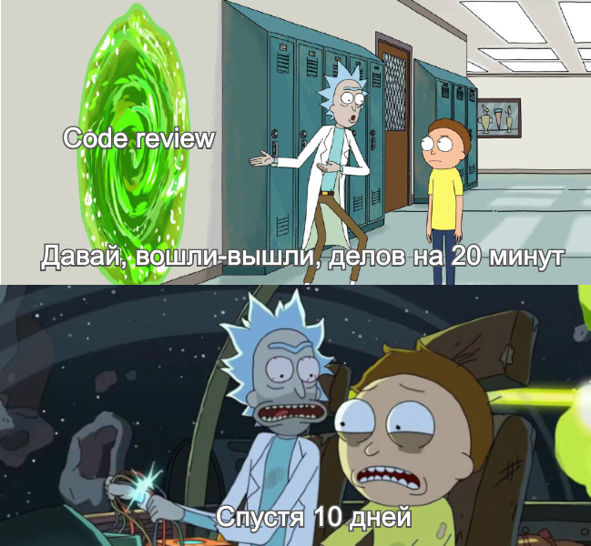

## Чистота нам только снится

&nbsp;&nbsp;&nbsp;&nbsp;Нет программиста, который не думал о том, как бы написать еще лучше.
 &nbsp;&nbsp;&nbsp;&nbsp;Нет разработчика, который на code review не думал, что код коллеги непонятен и может быть написан лучше.
 &nbsp;&nbsp;&nbsp;&nbsp;Нет руководителя, который не думал о важности качество кода и решений, нанимаемых им людей.
 &nbsp;&nbsp;&nbsp;&nbsp;Желание сделать лучше, которое проходит красной нитью по нашему труду также переносится и на нашу внутреннюю
кухню. Где за историю разработки программного обеспечения оно породило множество языков и фреймворков, практик, а также
материала по качеству кода и грамотным архитектурным решениям.
 &nbsp;&nbsp;&nbsp;&nbsp;Подходя к практике с любым языком программирования и конкретной задачей, без наличия опыта о том,
как сделать лучше, человек все равно задает себе вопросы и, каждый по своему, но приоритезирует себе их.
- Как написать, чтобы другие поняли?
- Как сделать, чтобы работало?
- Решал ли другой эту задачу ранее?
- Можно ли использовать готовое решение для отдельных шагов?
- Как написать, чтобы в следующий раз быстрее сделать аналогичную задачу?

&nbsp;&nbsp;&nbsp;&nbsp;Ответы на эти и аналогичные вопросы включают в том числе и известные практики:
- ООП и шаблоны проектирования
- Принципи и рекомендации чистого кода
- Известные принципы разработки и дизайна ПО (SOLID, GRASP и пр.)
- Практики процессов разработчки (TDD, ATDD и пр.)

&nbsp;&nbsp;&nbsp;&nbsp;Программист же, отвечая на эти вопросы, путем самостоятельных проб, общения и
изучения существующего материала рано или поздно, но открывает для себя ту или иную практику и интегрирует
в свои решения. На этом пути он принимает множество компромиссов, один из важнеший - компромисс поддержки и скорости.
Результатом этих компромиссов становится то, что множество проектов не могут уверенно сказать, что они пишут чисто
или полностью используют ту или иную практику.
 &nbsp;&nbsp;&nbsp;&nbsp;В попытке проанализировать ситуацию на отдельном проекте люди приходят к
оценочным методам и стандартам, таким как:
- Статический анализ кода
- Code review
- Юнит-тестирование
- Check-style проверки
- Различные верификации состава дистрибутива

&nbsp;&nbsp;&nbsp;&nbsp;В данном списке только code review позволяет проверить код на осмысленность, рациональность
и соответствие общим стандартам. Автоматизированные способы проверки никогда не помогут:
- Выделить общие компоненты
- Применить шаблон проектирования
- Выделить избыточность
- Проверить концептуальное дублирование в рамках проекта или даже open source кода
- Проверить прозрачность кода и удобочитаемость

&nbsp;&nbsp;&nbsp;&nbsp;Проверить же скорость работы программы также можно автоматизированным средствами, попробовав различные решения.
Но именно переиспользуемость, читаемость и масштабируемость кода имеет вес для будущего проекта и его поддержки,
это влияет на стоимость доработки, как стоимость изменения.
 &nbsp;&nbsp;&nbsp;&nbsp;Code review приносят новые компромиссы, попытки сделать код чище идут какое-то время,
пока у разработчиков хватает энтузиазма поддерживать качество, погружаясь в код коллег.
Компромиссы превращаются в технический долг и вопросы "на подумать". Из множества советов в сети, как сделать лучше или
не допускать этого, хочу выделить правило бойскаута:
> Оставь место стоянки чище, чем оно было до твоего прихода

&nbsp;&nbsp;&nbsp;&nbsp;Это единственное правило, которое может спасти существующий проект. Для нового же проекта 
его можно сократить до: "Создай место, на которое захотят приходить". С его разработкой единственный вариант заранее
оставить код готовым к различным изменениям - это оставить его максимально чистым и читаемым сейчас в рамках имеющегося ресурса.

(прийти к тому, что люди открытывают для себя различные практики, но зачастую очень долго к этому идут)

